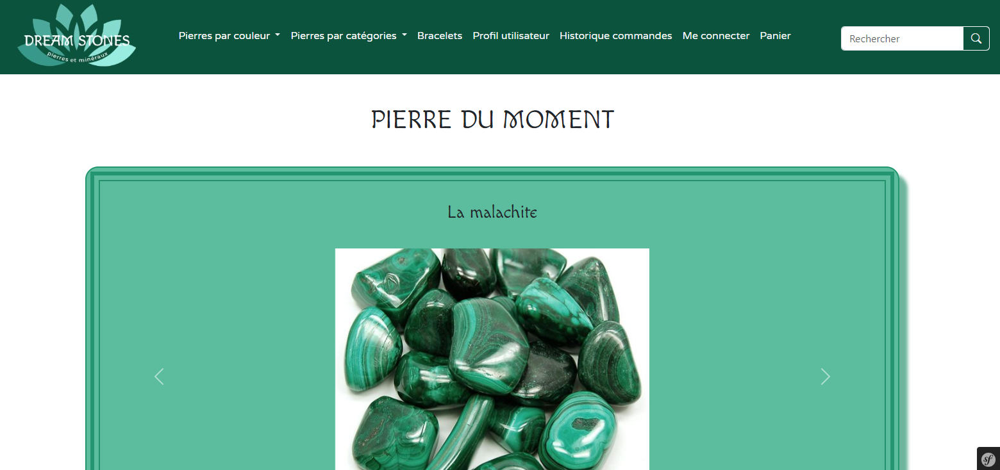

# Projet Symfony

Bienvenue sur le projet réalisé avec le framework Symfony.

## Configuration du Projet

Pour visionner ce projet, suivez ces étapes :

1. **Installation de la Base de Données** :
   Importez la base de données du projet disponible dans le dossier "database".

     -- Créer la base de données
CREATE DATABASE IF NOT EXISTS dream_stones_project DEFAULT CHARACTER SET utf8mb4 COLLATE utf8mb4_general_ci;

-- Utiliser la base de données
USE dream_stones_project;

-- Importer la structure de la base de données à partir du fichier SQL
SOURCE database\Dump20240330.sql;

2. **Configuration de la Base de Données** :
   Modifiez la configuration de la base de données dans le fichier `config/packages/doctrine.yaml` avec vos propres identifiants.

## Démarrage du Serveur Local

Une fois que la base de données est installée et configurée, vous pouvez démarrer le serveur local en utilisant la commande suivante :
symfony server:start

Cela démarrera le serveur local et vous pourrez accéder au projet dans votre navigateur à l'adresse http://localhost:8000/app.

# Commandes Symfony Utiles

Voici quelques commandes Symfony utiles pour gérer votre projet :

## Installation des Dépendances
composer install

## Création de la Base de Données
php bin/console doctrine:database:create

## Migrations de la Base de Données
php bin/console doctrine:migrations:migrate

## Création d'un Contrôleur
php bin/console make:controller
